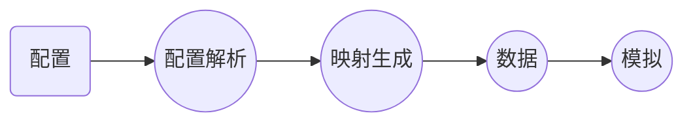
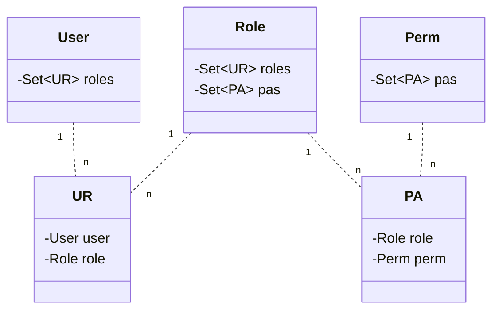

# 数据流图

```mermaid
graph LR
    config(配置)
    configparse((配置解析))
    mapgen((映射生成))
    data((数据))
    sim((模拟))

    config-->configparse
    configparse-->mapgen
    mapgen-->data
    data-->sim
```

# 数据

```mermaid
classDiagram
    class User {
        -Set~UR~ roles
    }

    class UR {
        -User user
        -Role role
    }

    class Role {
        -Set~UR~ roles
        -Set~PA~ pas
    }

    class PA {
        -Role role
        -Perm perm
    }

    class Perm {
        -Set~PA~ pas
    }

    User "1" .. "n" UR
    Role "1" .. "n" UR
    Role "1" .. "n" PA
    Perm "1" .. "n" PA
```
